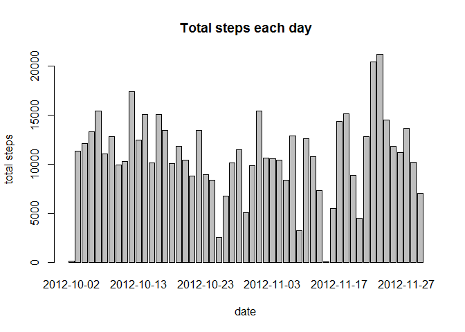
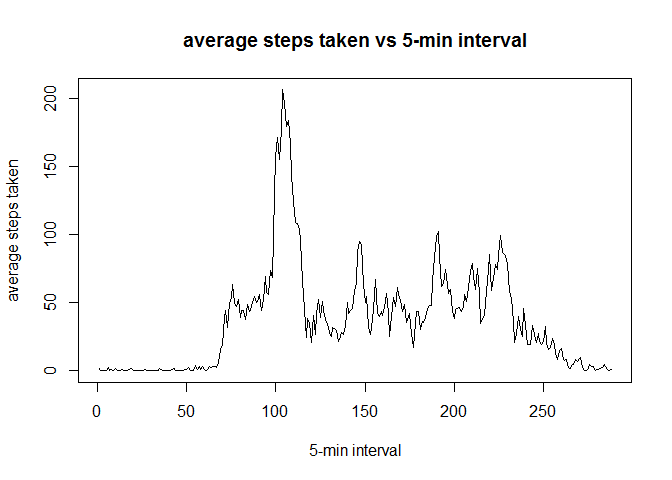
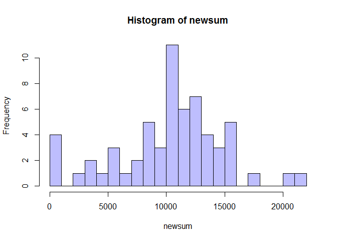
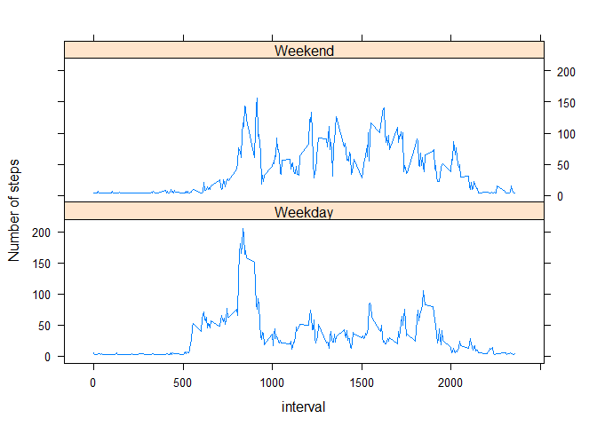

# Reproducible Research: Peer Assessment 1


## Loading and preprocessing the data

1. Load the data

```r
#   load the data
data <- read.csv("activity.csv")
str(data)
```

```
## 'data.frame':	17568 obs. of  3 variables:
##  $ steps   : int  NA NA NA NA NA NA NA NA NA NA ...
##  $ date    : Factor w/ 61 levels "2012-10-01","2012-10-02",..: 1 1 1 1 1 1 1 1 1 1 ...
##  $ interval: int  0 5 10 15 20 25 30 35 40 45 ...
```
2. Process/transform the data (if necessary) into a format suitable for your analysis


```r
#   reduce the data with steps = NA and transform the date column to Date class
NAvalue <- is.na(data$steps)
subdata <- data[!NAvalue,]
subdata$date <- as.Date(subdata$date, "%Y-%m-%d")
str(subdata)
```

```
## 'data.frame':	15264 obs. of  3 variables:
##  $ steps   : int  0 0 0 0 0 0 0 0 0 0 ...
##  $ date    : Date, format: "2012-10-02" "2012-10-02" ...
##  $ interval: int  0 5 10 15 20 25 30 35 40 45 ...
```


## What is mean total number of steps taken per day?
1. Make a histogram of the total number of steps taken each day

```r
# find the total steps taken each day
sum <- sapply(split(subdata, subdata$date), function(x){ sum(x$steps)})

# graph the histogram using barplot
barplot(sum, main = "Total steps each day", xlab = "date", ylab = "total steps")
```

 

2. Calculate and report the mean and median total number of steps taken per day

```r
mean <- sapply(split(subdata, subdata$date), function(x){ mean(x$steps)})
mean
```

```
## 2012-10-02 2012-10-03 2012-10-04 2012-10-05 2012-10-06 2012-10-07 
##     0.4375    39.4167    42.0694    46.1597    53.5417    38.2465 
## 2012-10-09 2012-10-10 2012-10-11 2012-10-12 2012-10-13 2012-10-14 
##    44.4826    34.3750    35.7778    60.3542    43.1458    52.4236 
## 2012-10-15 2012-10-16 2012-10-17 2012-10-18 2012-10-19 2012-10-20 
##    35.2049    52.3750    46.7083    34.9167    41.0729    36.0938 
## 2012-10-21 2012-10-22 2012-10-23 2012-10-24 2012-10-25 2012-10-26 
##    30.6285    46.7361    30.9653    29.0104     8.6528    23.5347 
## 2012-10-27 2012-10-28 2012-10-29 2012-10-30 2012-10-31 2012-11-02 
##    35.1354    39.7847    17.4236    34.0938    53.5208    36.8056 
## 2012-11-03 2012-11-05 2012-11-06 2012-11-07 2012-11-08 2012-11-11 
##    36.7049    36.2465    28.9375    44.7326    11.1771    43.7778 
## 2012-11-12 2012-11-13 2012-11-15 2012-11-16 2012-11-17 2012-11-18 
##    37.3785    25.4722     0.1424    18.8924    49.7882    52.4653 
## 2012-11-19 2012-11-20 2012-11-21 2012-11-22 2012-11-23 2012-11-24 
##    30.6979    15.5278    44.3993    70.9271    73.5903    50.2708 
## 2012-11-25 2012-11-26 2012-11-27 2012-11-28 2012-11-29 
##    41.0903    38.7569    47.3819    35.3576    24.4688
```

```r
median <- sapply(split(subdata, subdata$date), function(x){ median(x$steps)})
median
```

```
## 2012-10-02 2012-10-03 2012-10-04 2012-10-05 2012-10-06 2012-10-07 
##          0          0          0          0          0          0 
## 2012-10-09 2012-10-10 2012-10-11 2012-10-12 2012-10-13 2012-10-14 
##          0          0          0          0          0          0 
## 2012-10-15 2012-10-16 2012-10-17 2012-10-18 2012-10-19 2012-10-20 
##          0          0          0          0          0          0 
## 2012-10-21 2012-10-22 2012-10-23 2012-10-24 2012-10-25 2012-10-26 
##          0          0          0          0          0          0 
## 2012-10-27 2012-10-28 2012-10-29 2012-10-30 2012-10-31 2012-11-02 
##          0          0          0          0          0          0 
## 2012-11-03 2012-11-05 2012-11-06 2012-11-07 2012-11-08 2012-11-11 
##          0          0          0          0          0          0 
## 2012-11-12 2012-11-13 2012-11-15 2012-11-16 2012-11-17 2012-11-18 
##          0          0          0          0          0          0 
## 2012-11-19 2012-11-20 2012-11-21 2012-11-22 2012-11-23 2012-11-24 
##          0          0          0          0          0          0 
## 2012-11-25 2012-11-26 2012-11-27 2012-11-28 2012-11-29 
##          0          0          0          0          0
```
## What is the average daily activity pattern?
1. Make a time series plot (i.e. type = "l") of the 5-minute interval (x-axis) and the average number of steps taken, averaged across all days (y-axis)


```r
# find the mean steps taken for each interval
average <- sapply(split(subdata, subdata$interval), function(x){ mean(x$steps)})

# graph the time series plot
plot(average, type = "l", main = "average steps taken vs 5-min interval", 
     xlab = "5-min interval", ylab = "average steps taken")
```

 


2. Which 5-minute interval, on average across all the days in the dataset, contains the maximum number of steps?

```r
# find out the max value in average
average[average == max(average)]
```

```
##   835 
## 206.2
```


## Imputing missing values

1. Calculate and report the total number of missing values in the dataset (i.e. the total number of rows with NAs)


```r
# use summary to find out the NA value in data$steps
summary(data)
```

```
##      steps               date          interval   
##  Min.   :  0.0   2012-10-01:  288   Min.   :   0  
##  1st Qu.:  0.0   2012-10-02:  288   1st Qu.: 589  
##  Median :  0.0   2012-10-03:  288   Median :1178  
##  Mean   : 37.4   2012-10-04:  288   Mean   :1178  
##  3rd Qu.: 12.0   2012-10-05:  288   3rd Qu.:1766  
##  Max.   :806.0   2012-10-06:  288   Max.   :2355  
##  NA's   :2304    (Other)   :15840
```
    So we know that there are 2304 rows with NAs.

2. Devise a strategy for filling in all of the missing values in the dataset. The strategy does not need to be sophisticated. For example, you could use the mean/median for that day, or the mean for that 5-minute interval, etc.
    
    To fill all of the missing values in the dataset, we will use the mean for that day if it exists, if there is no mean for that day (for the date 2012-11-30, there are only NAs for this date ), we will fill 0.
    
3. Create a new dataset that is equal to the original dataset but with the missing data filled in.


```r
# copy the dataset
newdata <- data

# fill in missing data for the copy dataset
for(i in 1:length(NAvalue)){
    if(NAvalue[i] == TRUE){
        # replace the NAs with the mean for that day if exits, else replace with 0 
        name <- newdata$date[i]
        if(!is.na(unname(mean[name]))){
            newdata$steps[i] <- unname(mean[name])
        } else newdata$steps[i] <- 0 
    } #end of if     
} # end of for

# check if the new dataset contains NAs
summary(newdata)
```

```
##      steps               date          interval   
##  Min.   :  0.0   2012-10-01:  288   Min.   :   0  
##  1st Qu.:  0.0   2012-10-02:  288   1st Qu.: 589  
##  Median :  0.0   2012-10-03:  288   Median :1178  
##  Mean   : 35.7   2012-10-04:  288   Mean   :1178  
##  3rd Qu.: 24.0   2012-10-05:  288   3rd Qu.:1766  
##  Max.   :806.0   2012-10-06:  288   Max.   :2355  
##                  (Other)   :15840
```


4. Make a histogram of the total number of steps taken each day and Calculate and report the mean and median total number of steps taken per day. Do these values differ from the estimates from the first part of the assignment? What is the impact of imputing missing data on the estimates of the total daily number of steps?


```r
# find the total steps taken each day
newsum <- sapply(split(newdata, newdata$date), function(x){ sum(x$steps)})

# graph the histogram using barplot
barplot(newsum, col = "red", main = "Total steps each day", xlab = "date", ylab = "total steps")
```

 

```r
# # add the histogram of the priviouse total using transparent black for comparing
# par(new = TRUE)
# barplot(sum, col = rgb(0,0,0,alpha=0.3), names.arg = "")

# get the new mean for each day
newmean <- sapply(split(newdata, newdata$date), function(x){ mean(x$steps)})
newmean
```

```
## 2012-10-01 2012-10-02 2012-10-03 2012-10-04 2012-10-05 2012-10-06 
##     0.4375     0.4375    39.4167    42.0694    46.1597    53.5417 
## 2012-10-07 2012-10-08 2012-10-09 2012-10-10 2012-10-11 2012-10-12 
##    38.2465    34.3750    44.4826    34.3750    35.7778    60.3542 
## 2012-10-13 2012-10-14 2012-10-15 2012-10-16 2012-10-17 2012-10-18 
##    43.1458    52.4236    35.2049    52.3750    46.7083    34.9167 
## 2012-10-19 2012-10-20 2012-10-21 2012-10-22 2012-10-23 2012-10-24 
##    41.0729    36.0938    30.6285    46.7361    30.9653    29.0104 
## 2012-10-25 2012-10-26 2012-10-27 2012-10-28 2012-10-29 2012-10-30 
##     8.6528    23.5347    35.1354    39.7847    17.4236    34.0938 
## 2012-10-31 2012-11-01 2012-11-02 2012-11-03 2012-11-04 2012-11-05 
##    53.5208    36.2465    36.8056    36.7049    11.1771    36.2465 
## 2012-11-06 2012-11-07 2012-11-08 2012-11-09 2012-11-10 2012-11-11 
##    28.9375    44.7326    11.1771    18.8924    49.7882    43.7778 
## 2012-11-12 2012-11-13 2012-11-14 2012-11-15 2012-11-16 2012-11-17 
##    37.3785    25.4722    44.3993     0.1424    18.8924    49.7882 
## 2012-11-18 2012-11-19 2012-11-20 2012-11-21 2012-11-22 2012-11-23 
##    52.4653    30.6979    15.5278    44.3993    70.9271    73.5903 
## 2012-11-24 2012-11-25 2012-11-26 2012-11-27 2012-11-28 2012-11-29 
##    50.2708    41.0903    38.7569    47.3819    35.3576    24.4688 
## 2012-11-30 
##     0.0000
```

```r
# get the new median for each day
newmedian <- sapply(split(newdata, newdata$date), function(x){ median(x$steps)})
newmedian
```

```
## 2012-10-01 2012-10-02 2012-10-03 2012-10-04 2012-10-05 2012-10-06 
##     0.4375     0.0000     0.0000     0.0000     0.0000     0.0000 
## 2012-10-07 2012-10-08 2012-10-09 2012-10-10 2012-10-11 2012-10-12 
##     0.0000    34.3750     0.0000     0.0000     0.0000     0.0000 
## 2012-10-13 2012-10-14 2012-10-15 2012-10-16 2012-10-17 2012-10-18 
##     0.0000     0.0000     0.0000     0.0000     0.0000     0.0000 
## 2012-10-19 2012-10-20 2012-10-21 2012-10-22 2012-10-23 2012-10-24 
##     0.0000     0.0000     0.0000     0.0000     0.0000     0.0000 
## 2012-10-25 2012-10-26 2012-10-27 2012-10-28 2012-10-29 2012-10-30 
##     0.0000     0.0000     0.0000     0.0000     0.0000     0.0000 
## 2012-10-31 2012-11-01 2012-11-02 2012-11-03 2012-11-04 2012-11-05 
##     0.0000    36.2465     0.0000     0.0000    11.1771     0.0000 
## 2012-11-06 2012-11-07 2012-11-08 2012-11-09 2012-11-10 2012-11-11 
##     0.0000     0.0000     0.0000    18.8924    49.7882     0.0000 
## 2012-11-12 2012-11-13 2012-11-14 2012-11-15 2012-11-16 2012-11-17 
##     0.0000     0.0000    44.3993     0.0000     0.0000     0.0000 
## 2012-11-18 2012-11-19 2012-11-20 2012-11-21 2012-11-22 2012-11-23 
##     0.0000     0.0000     0.0000     0.0000     0.0000     0.0000 
## 2012-11-24 2012-11-25 2012-11-26 2012-11-27 2012-11-28 2012-11-29 
##     0.0000     0.0000     0.0000     0.0000     0.0000     0.0000 
## 2012-11-30 
##     0.0000
```
    We can see that after replacing the NAs with the mean for that day, the total steps, mean and median for each day change. For the total steps and mean, these values may be increased or decreased; for the median, all values increases. 

## Are there differences in activity patterns between weekdays and weekends?
1. Create a new factor variable in the dataset with two levels - "weekday" and "weekend" indicating whether a given date is a weekday or weekend day.


```r
# make another new copy of the dataset(the one with filling the NAs)
new2data <- newdata
new2data$date <- as.Date(new2data$date, "%Y-%m-%d")

# find out the weekdays of that date
new2data <- cbind(new2data, weekday = weekdays(new2data$date, abbreviate = TRUE))
new2data$weekday <- as.character(new2data$weekday)

# create a vector to identify the date of weekend
is_weekend <- new2data$weekday == "Sat" | new2data$weekday == "Sun"

# transformation
for(i in 1:length(is_weekend)){
    if(is_weekend[i] == TRUE) new2data$weekday[i] <- "Weekend"
    else new2data$weekday[i] <- "Weekday"
} # end of for

new2data$weekday <- as.factor(new2data$weekday)
summary(new2data)
```

```
##      steps            date               interval       weekday     
##  Min.   :  0.0   Min.   :2012-10-01   Min.   :   0   Weekday:12960  
##  1st Qu.:  0.0   1st Qu.:2012-10-16   1st Qu.: 589   Weekend: 4608  
##  Median :  0.0   Median :2012-10-31   Median :1178                  
##  Mean   : 35.7   Mean   :2012-10-31   Mean   :1178                  
##  3rd Qu.: 24.0   3rd Qu.:2012-11-15   3rd Qu.:1766                  
##  Max.   :806.0   Max.   :2012-11-30   Max.   :2355
```


2. Make a panel plot containing a time series plot (i.e. type = "l") of the 5-minute interval (x-axis) and the average number of steps taken, averaged across all weekday days or weekend days (y-axis). The plot should look something like the following, which was creating using simulated data:

```r
# find the mean steps taken for each interval
library(plyr)
cleandata <- ddply(new2data, c("weekday", "interval"), function(x){ mean(x$steps)})
names(cleandata) <- c("weekday", "interval", "mean_steps")

# graph the time series plot
library(lattice)
xyplot(cleandata$mean_steps ~ cleandata$interval | factor(cleandata$weekday)
       , type = "l", layout = c(1,2), xlab = "interval", ylab = "Number of steps")
```

 
